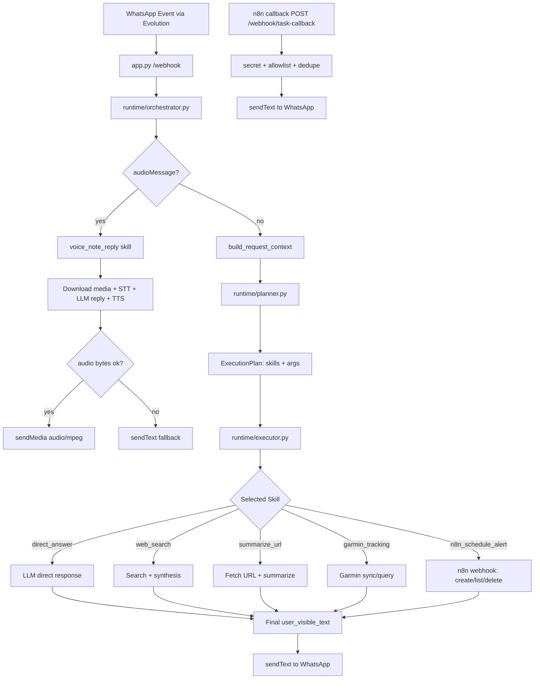

# Travis Agent

**Travis Agent** is a **structural core for AI-based personal assistants**, designed to run in conversational interfaces (such as WhatsApp) and evolve into an **agent system with memory, tools, and reliable execution**.

This project is public by design: it exposes **the architectural foundation of a modern agent**, with clear separation between **interface, reasoning, execution, and memory**.  
More than a bot, Travis Agent is a **minimal runtime for operational agents**.

---

## Vision

Most AI projects start from the model.  
Useful systems start from the **architecture**.

Travis Agent is built on three assumptions:

1. **LLMs are the cognitive engine, not the whole system**
2. **Useful agents must operate in the real world**
3. **Memory and tools are as important as the model**

The goal is to provide a **structured base for evolvable personal assistants** that can:

- converse
- access external tools
- keep context
- operate on real-world information
- evolve into more advanced memory systems

---

## Positioning

Travis Agent is not just:

- a chatbot
- an API wrapper
- a webhook prompt

It is better described as:

> **a minimalist runtime for personal agents with LLMs, tools, and operational state**

The architecture is intentionally designed to evolve into:

- **persistent personal assistants**
- **multi-tool agents**
- **long-term memory**
- **cognitive automation systems**

---

## Architecture

The system follows a simple principle:

```text
Interface -> Runtime/Engine -> Tools -> Memory -> External World
```

### 1) Conversational Interface

The current interface uses **WhatsApp** via Evolution API.

Responsibilities:

- receive messages via webhook
- normalize events
- route to V2 runtime
- send responses back to the user

This layer is **replaceable**. Other interfaces can be added:

- Slack
- Telegram
- Email
- Web UI
- APIs

### 2) Cognitive Core (V2 Only)

The system runs on the V2 runtime with planner + executor + static skills.

### 3) Tools and Skills

Tools represent low-level capabilities in the real world.

Examples:

```text
web_search
summarize_url
n8n_schedule_alert
```

In V2, skills encapsulate behavior and can orchestrate tool usage.

Core principle:

> **Tools are capabilities. Skills are intelligent operational flows.**

### 4) Operational Memory

The agent keeps per-sender session state, including:

- conversation history
- recent context
- transient interaction state
- message deduplication support

This corresponds to **short-term operational memory**, with room to evolve into richer memory layers.

### 5) Infrastructure

The project runs on **Docker Compose** for local and server deployment.

Current stack:

```text
Travis Agent
Evolution API (WhatsApp)
Redis
PostgreSQL
```

Infrastructure responsibilities:

- message deduplication
- operational state support
- future persistence paths
- service isolation

---

## Execution Flow

Simplified message flow:

```text
User sends message
      ↓
Webhook receives event
      ↓
V2 Runtime is selected
      ↓
Context is built
      ↓
LLM plans/reasons (and uses tools/skills when needed)
      ↓
Tools execute
      ↓
Final response is produced
      ↓
Message is sent back to user
```

### Execution Flow (V2 Skills Detailed)



---

## Design Principles

### Separation of Responsibilities

| Layer | Responsibility |
| --- | --- |
| Interface | communication |
| Engine/Runtime | reasoning and orchestration |
| Tools | capabilities |
| Memory | context and state |
| Infrastructure | reliability and operations |

### Structural Simplicity

The goal is not a heavy framework, but a **clear and extensible core**.

Less abstraction.  
More control.

### Incremental Evolution

The project is designed to grow naturally:

```text
Chatbot
  ↓
Tool Agent
  ↓
Personal Assistant
  ↓
Cognitive System with Memory
```

---

## Use Cases

With expanded tools and memory, Travis Agent can evolve into:

- personal assistant
- productivity copilot
- automation interface
- research agent
- information aggregator
- workflow operator

---

## Why This Project Is Public

Travis Agent exposes **the base architecture of a modern agent**.

This enables:

- learning
- experimentation
- contribution
- architecture analysis

The intent is not only to publish code, but to make explicit **the structure required for operational agents**.

---

## Roadmap Direction

### Memory

- semantic memory
- embeddings
- contextual retrieval
- persistent history

### Tools

- document access
- external integrations
- automation
- enterprise APIs

### Interface

- multi-channel support
- web panel
- administrative control

### Agents

- specialized multi-agent setups
- orchestration
- cognitive workflows

---

## Operations

- See [PLAYBOOK.md](./PLAYBOOK.md) for runbooks (build, recreate, rollback, troubleshooting).
- See [WORKLOG.md](./WORKLOG.md) for current status and latest decisions.
- See [AGENT.md](./AGENT.md) for canonical context and definitions.
- Use [`.env.sample`](./.env.sample) as the safe environment template.

### Voice Notes

- Inbound WhatsApp `audioMessage` is handled by the internal skill `voice_note_reply`.
- This voice path is deterministic and does not use the planner/executor route for the inbound audio event.
- Processing flow:
  - download audio from Evolution API (`getBase64FromMediaMessage`)
  - transcribe via `POST {VOICE_API_URL}/transcribe`
  - generate response text with LLM
  - synthesize via `POST {VOICE_API_URL}/tts` (`format=mp3`)
  - send MP3 back to WhatsApp (`sendMedia`, `mediatype=audio`)
- Required env vars:
  - `VOICE_API_URL`
  - `VOICE_API_TIMEOUT`
  - `VOICE_LANGUAGE_DEFAULT`
- Docker note:
  - if Travis runs in Docker and voice backend runs on host, use `VOICE_API_URL=http://host.docker.internal:<port>`
  - the backend port must be exposed on host (not only `127.0.0.1` loopback) for container access.

### n8n Schedule Alerts (V2)

- V2 includes internal skill `n8n_schedule_alert` for schedule create/list/delete.
- Skill routing is planner-driven (LLM plan). There is no keyword/lexical fallback for n8n intent in the planner.
- Contracts sent to n8n webhook:
  - create: `{"action":"create","data":{"title":"...","run_at":"ISO8601","payload":{"message":"...","target":{"sender":"<jid>","instance":"<instance>"}}}}`
  - list: `{"action":"list","data":{"payload":{"target":{"sender":"<jid>","instance":"<instance>"}}}}`
  - delete: `{"action":"delete","data":{"idTask":"...","task_id":"...","payload":{"target":{"sender":"<jid>","instance":"<instance>"}}}}`
- If date/time is ambiguous for create, Travis asks one short clarification and does not create the task.
- If `idTask` is missing for delete, Travis asks one short clarification and does not call n8n.
- Optional callback delivery endpoint:
  - `POST /webhook/task-callback`
  - header: `X-Task-Secret` (when `TASK_CALLBACK_SECRET` is configured)
  - expected callback fields: `task_id|idTask`, sender, and message.
- If `OPENAI_API_KEY` is unavailable, planner fallback defaults to `direct_answer` (it will not force-route to n8n).

### Garmin Token Bootstrap (local repo)

To generate Garmin tokens directly in this repository (without external projects):

```bash
python3 -m venv .venv
./.venv/bin/pip install -r requirements.txt
./.venv/bin/python3 scripts/bootstrap_garmin_tokens.py --token-dir ./.garminconnect
```

If MFA is required:

```bash
./.venv/bin/python3 scripts/bootstrap_garmin_tokens.py --token-dir ./.garminconnect --mfa 123456
```

Then set in `.env`:

```env
GARMINTOKENS=/garmin_tokens
GARMINTOKENS_HOST_PATH=/home/<user>/repositories/travis-agent/.garminconnect
```

---

## Conclusion

Travis Agent is **an architectural foundation for AI-based personal agents**.

It does not try to solve everything at once.  
It builds **the right structure to evolve safely**.

Instead of starting from a prompt, it starts from a system.

That is what allows an agent to move beyond a bot and become **operational cognitive infrastructure**.
